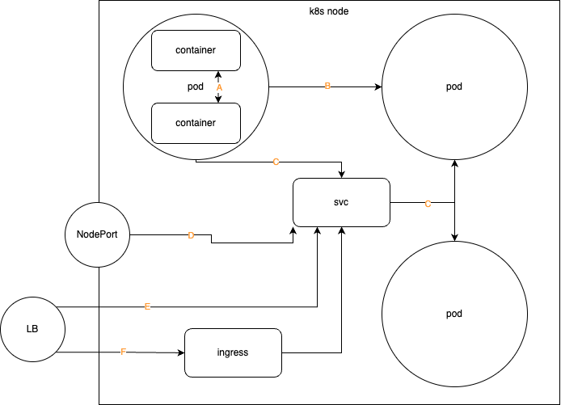

# Kubernetes Networking



<figure><figcaption></figcaption></figure>

### Container-to-Container Communication 

In Kubernetes, a Pod is the basic unit of deployment. Containers in one pod even share the SAME _network namespace_, they can communicate with each other through localhost.

### Pod-to-Pod Communication 

All Pods in a Kubernetes cluster reside in a single, flat, shared network address space (kubenet or CNI does this magic with iptables, each CNI behaves a little differently). A flat network address space means that all Pods within a Kubernetes cluster are assigned unique IP addresses and can access every other Pod at the other Pod’s IP address directly.&#x20;

Even if some Pods live in different nodes, which are separated by additional, external networks. Pods still behave as if they are connected to the same, single internal network.

### Pod-to-Service Communication (ClusterIP) 

Pods are ephemeral, while Service are not. When a ClusterIP Service is created, it gets a static IP which never changes during the lifetime of the Service. This way, pods can connect directly to Pods, and clients connect to the ClusterIP Service through its IP address.

Pods can find Service's static IP because of KubeDNS or CoreDNS.

### External-to-Service Communication (NodePort) 

Once the NodePort Service is created, Kubernetes reserves port 30001 on ALL of its nodes and configures them the following way: all external traffic coming into the nodes, on port 30001, will be forwarded to a particular Service

NodePort Service does not provide any sort of load balancing across the nodes, meaning, to access the Service from an external client, you need to connect to the IP address of one of the nodes and the port number.

### External-to-Service Communication (LoadBalancer) 

A LoadBalancer Service is a way to distribute traffic across multiple nodes in the cluster.

For a LoadBalancer Service to work, it is required to use Kubernetes on a cloud platform that supports the LoadBalancer Service type. Load-balancing logic is then implemented by the cloud provider and not by Kubernetes.

### External-to-Service Communication (Ingress) 

Kubernetes ingress acts as a layer between your services and the outside world, providing load balancing, SSL termination, and routing based on your defined rules.

\---



